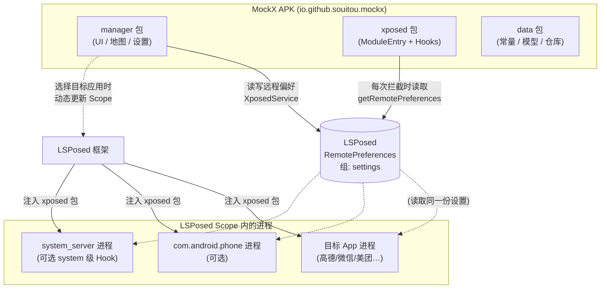
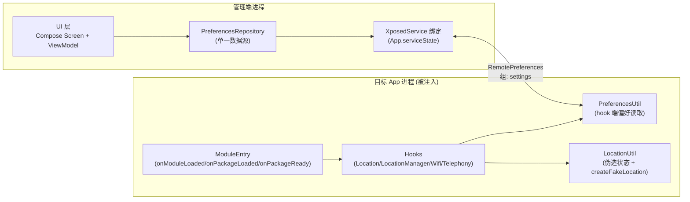
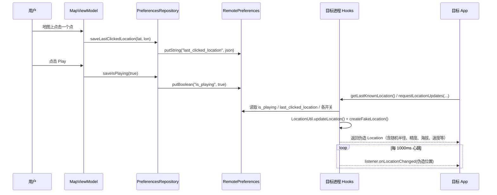
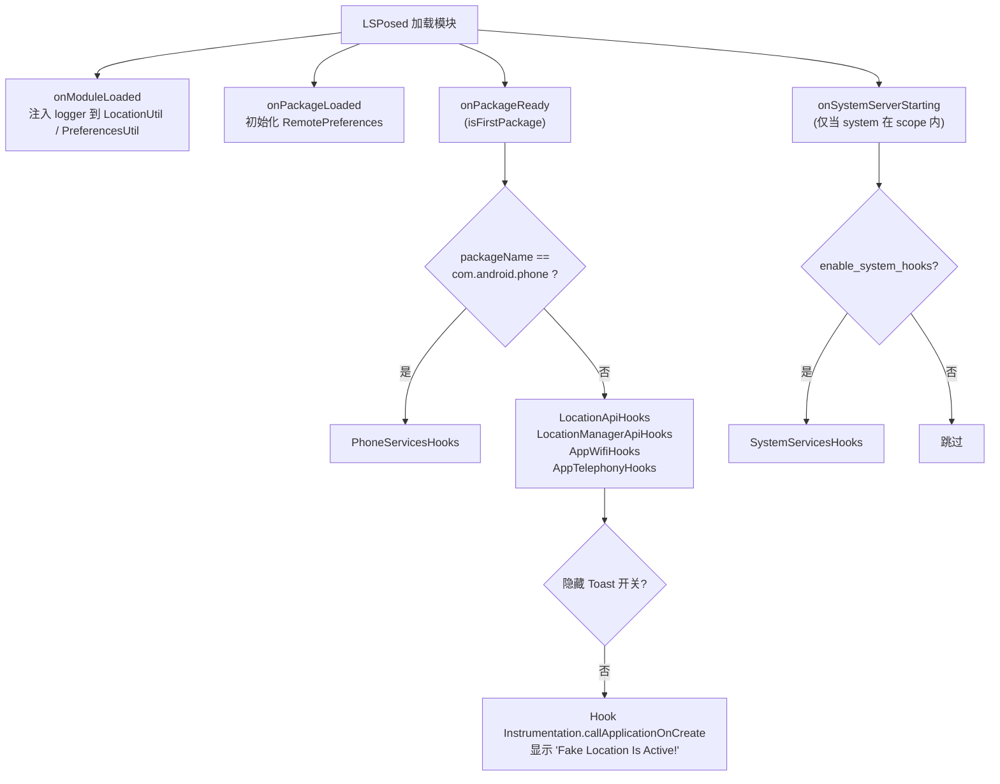

# 01 - 项目整体架构

## 1. 一句话概括

MockX 是一个**单 APK、双形态**的项目：同一个 `app` 模块既是普通的 Compose 管理端应用，又是通过 `META-INF/xposed` 声明的 LSPosed 模块；管理端负责"设置什么"，被注入的目标进程负责"让 App 看到什么"。

## 2. 三种运行形态

| 形态 | 载体 | 安装的 Hook | 触发条件 |
| :--- | :--- | :--- | :--- |
| 管理端 App | 用户手动启动 | 无（不 Hook 自身） | — |
| 目标 App 进程 | LSPosed 注入 | `LocationApiHooks` + `LocationManagerApiHooks` + `AppWifiHooks` + `AppTelephonyHooks` | 用户在 Target Apps 屏选中该应用 |
| `com.android.phone` | LSPosed 注入 | `PhoneServicesHooks` | 开启系统级 Hook（加入 scope） |
| `system_server` | LSPosed 注入 | `SystemServicesHooks` | 开启系统级 Hook（加入 scope） |

## 3. 进程内分层

- **管理端**：`Screen → ViewModel → PreferencesRepository → App.service（XposedService）→ RemotePreferences`。UI 从不直接触碰 SharedPreferences。
- **Hook 端**：`ModuleEntry` 在 `onPackageLoaded` 阶段初始化 `PreferencesUtil`（远程偏好），各 Hook 在**每次拦截时**调用 `LocationUtil.updateLocation()` 拉取最新设置——这就是"热更新、无需重启目标 App"的实现基础。

## 4. 关键数据流：一次位置伪造

要点：

1. **坐标写入永远是 WGS-84**。高德底图（GCJ-02）上的点击由 UI 层先经 `CoordinateTransform.gcj02ToWgs84()` 反算再持久化（详见 [02 - 管理端](02-Manager-App.md#32-坐标系-transformcoordinate)）。
2. **Hook 端零缓存决策**：`getIsPlaying()`、`getUseAccuracy()` 等每次拦截都重新读取远程偏好，保证管理端改动实时生效。
3. **可选字段带开关**：精度/海拔/垂直精度/海平面/速度等字段均有 `use_xxx` 布尔开关，关闭时回退原始 Location 的对应值。

## 5. Hook 安装决策流程

`ModuleEntry`（[代码](../../app/src/main/java/com/noobexon/xposedfakelocation/xposed/ModuleEntry.kt)）按进程分派：

## 6. Scope 管理：从"手动勾选"到"App 内托管"

`META-INF/xposed/scope.list` 为**空文件**（`staticScope=false`），即模块不声明静态 scope。管理端在 Target Apps 屏勾选应用时：

1. 包名集合写入远程偏好 `target_apps`（JSON 数组）——供 `SystemServicesHooks` / `PhoneServicesHooks` 做**调用方归因判断**（`shouldSpoofPackage`）；
2. 同时通过 XposedService 动态更新 LSPosed 模块 scope——新增应用需强杀重启该应用一次以完成注入，之后所有改动热生效。

系统级 Hook 开关（`enable_system_hooks`）会向 scope 添加/移除 `system` 与 `com.android.phone` 两个虚拟包名（见 `Constants.SYSTEM_HOOK_PACKAGES`）。

## 7. 设计取舍备忘

| 决策 | 原因 |
| :--- | :--- |
| 命名空间与 applicationId 不一致 | 保留上游包名 `com.noobexon.xposedfakelocation` 降低合并冲突，仅重命名对外标识（`io.github.souitou.mockx`） |
| `compileOnly` libxposed api + `implementation` libxposed service | api 由 LSPosed 运行时提供；service 需打进 APK 供管理端绑定 |
| Hook 端每次拦截都读偏好而非监听变更 | 实现最简单的热更新，偏好读取为内存读，开销可忽略 |
| 1 秒心跳主动分发 | 防止高德等 SDK 在室内无卫星信号时超时降级到网络定位 |
| `Double` 以 long bits 存 SharedPreferences | `SharedPreferences` 无 `putDouble`，读写两侧（Repository / PreferencesUtil）对称编码 |
