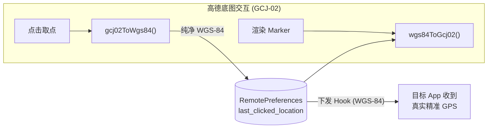

# 02 - 管理端 App（`manager` 包）

管理端是用户直接交互的 Compose 应用，职责：**选点（地图）、管理目标应用、调整伪造参数、控制开始/停止**，并把结果写入远程偏好供 Hook 端消费。

## 1. 包结构

```text
manager/
├── App.kt                     # Application：XposedService 绑定 + 高刷生命周期监听
├── MainActivity.kt            # 唯一 Activity：主题 + NavGraph 宿主
├── AppViewModel.kt            # 应用级状态（主题选项）
├── RefreshRateHelper.kt       # 高刷新率探测与 Window 属性注入
├── control/
│   └── ControlReceiver.kt     # 外部广播控制（默认禁用）
├── localization/
│   ├── LocaleController.kt    # 应用内语言切换
│   └── LanguageOption.kt
└── ui/
    ├── navigation/
    │   ├── Screen.kt          # 路由密封类（about/favorites/map/permissions/settings/target_apps）
    │   └── NavGraph.kt        # NavHost + 抽屉导航
    ├── map/                   # 主战场：地图选点（最大子包，见下文）
    ├── settings/              # 设置屏幕（含地图设置、Wi-Fi 身份、系统级 Hook 等分组）
    ├── targetapps/            # 目标应用选择（驱动 LSPosed scope）
    ├── favorites/             # 收藏地点管理
    ├── permissions/           # 权限引导页
    ├── about/                 # 关于页
    └── theme/                 # 主题（Theme/Color/Type/ThemeOption + Miuix 组件封装）
```

## 2. 应用入口链

`App.onCreate()`（[代码](../../app/src/main/java/com/noobexon/xposedfakelocation/manager/App.kt)）：

1. `XposedServiceHelper.registerListener(this)` —— 注册 **恰好一次** 的服务监听；绑定成功后 `App.service`（`StateFlow<XposedService?>`）非空，`PreferencesRepository` 的远程读写才可用；
2. 注册 `ActivityLifecycleCallbacks`，在每个 Activity 的 `onCreated/onResumed` 应用高刷新率。

`MainActivity`（[代码](../../app/src/main/java/com/noobexon/xposedfakelocation/manager/MainActivity.kt)）：

1. `attachBaseContext` 中经 `LocaleController.attachBaseContext()` 包裹，实现应用内语言覆盖；
2. `onCreate` 加载 OSMDroid `Configuration`、应用高刷、`enableEdgeToEdge()`；
3. `setContent` 中根据 `AppViewModel.themeOption`（SYSTEM/LIGHT/DARK）决定深色模式，渲染 `AppNavGraph`。

## 3. 地图子包（`ui/map/`）

### 3.1 文件职责

| 文件 | 职责 |
| :--- | :--- |
| `MapScreen.kt` | 主屏幕 Composable：顶栏、三点菜单（图源切换）、FAB（Play/Stop）、各弹窗宿主 |
| `MapViewModel.kt` | 单一 `MapUiState` 状态源 + Channel 一次性事件（goToPoint/centerMap/navigateToFavorites）+ 弹窗输入校验 |
| `MapModel.kt` | `MapUiState` / 输入框状态 / 弹窗可见性等不可变数据类 |
| `MapViewContainer.kt` | OSMDroid `MapView` 的 AndroidView 封装与生命周期 |
| `MapViewEffects.kt` | 副作用集合：初始定位、相机动画、Marker 管理、缩放持久化、取点事件反算 |
| `Drawer.kt` | 导航抽屉（Map/Favorites/TargetApps/Settings/About） |
| `MapDialogs.kt` | 坐标跳转、收藏增删改、重置确认等 `WindowDialog`（Miuix） |
| `MapSourceSelectionDialog.kt` | 图源切换单选弹窗（Miuix `RadioButtonPreference`） |
| `MapSourceOption.kt` | 图源枚举：`AMAP_VECTOR` / `AMAP_SATELLITE` / `TIANDITU_VECTOR` / `OPEN_STREET_MAP` |
| `CustomTileSources.kt` | 高德（wprd0{1-4}.is.autonavi.com，style=7 矢量 / style=6 卫星）与天地图在线瓦片源实现，**每图源独立缓存前缀** |
| `CoordinateTransform.kt` | GCJ-02 ↔ WGS-84 高精度转换（详见下节） |
| `Gcj02LocationProvider.kt` | 继承 OSMDroid `GpsMyLocationProvider`，实时纠偏"我的位置"蓝点以对齐 GCJ-02 底图 |

### 3.2 坐标系 Transform（`CoordinateTransform`）

高德底图使用 **GCJ-02（火星坐标系）**，而持久化与 Hook 下发的坐标必须为 **WGS-84**，否则存在 300–500 米偏移。处理链路：



| 函数 | 说明 |
| :--- | :--- |
| `outOfChina(lat, lon)` | 精确判定中国大陆边界；境外坐标直接旁路、不加偏 |
| `wgs84ToGcj02(lat, lon)` | 正向标准火星加密 |
| `gcj02ToWgs84(gcjLat, gcjLon)` | **4 轮不动点迭代**高精度反算，误差 < 1e-8 度（毫米级），消除单次减法反算的 1–2 米漂移 |

对应单元测试：`app/src/test/.../map/CoordinateTransformTest.kt`。

## 4. 其他屏幕

### 4.1 Settings（`ui/settings/`）

`SettingsModel.kt` 定义分组与条目结构，`SettingsScreen.kt` 渲染（Miuix 偏好组件 + 全局搜索索引），`SettingsViewModel.kt` 绑定各设置项的响应式 Flow。设置分组包括：

- 伪造参数：精度、海拔、垂直精度、海平面（及精度）、速度（及精度）、随机半径；
- 地图设置：图源选择、天地图 Token；
- Wi-Fi 身份：SSID / BSSID / RSSI（受 `enable_wifi_identity` 总开关门控）；
- 系统级：`enable_system_hooks`（添加/移除 `system` + `com.android.phone` scope，需重启）；
- 外部广播控制（`enable_broadcast_control`，默认关）；
- Toast 隐藏、语言、主题。

### 4.2 Target Apps（`ui/targetapps/`）

搜索并列出设备上所有应用（`QUERY_ALL_PACKAGES` 权限），勾选即：

1. 写远程偏好 `target_apps`；
2. 通过 XposedService 更新 LSPosed scope；
3. Root 设备上可点击重开按钮强杀重启目标应用（首次注入）。

### 4.3 Favorites（`ui/favorites/`）、About、Permissions

- Favorites：收藏地点的增删改查（存储在**本地**偏好，见 [04 - 数据层](04-Data-Layer.md)）；
- About：应用信息 + 上游 fork 源码卡片；
- Permissions：定位/存储等权限引导。

## 5. 横切能力

### 5.1 高刷新率（`RefreshRateHelper`）

解决二级纯 Compose 列表页在 HyperOS / ColorOS / OriginOS 上被锁 60 帧的问题：

1. 严格在**匹配当前物理分辨率**的显示模式中选择最高刷新率（避免多分辨率设备 mode 冲突被拒）；
2. 注入 `preferredDisplayModeId`（API 23+）与 `preferredRefreshRate`（API 30+）；
3. 反射为 `decorView` 及根视图注入 `setFrameRate()` / `setFrameRateCategory(HIGH)`；
4. `SettingsScreen` / `TargetAppsScreen` 进入时经 `LaunchedEffect` 主动请求并绑定当前 `LocalView`。

### 5.2 应用内多语言（`LocaleController` / `LanguageOption`）

支持中/英/德三语；语言 Tag 存本地偏好 `language_tag`，`attachBaseContext` 阶段用 `Locale.createConfigurationContext` 包裹 base context，切换即时生效。

### 5.3 外部广播控制（`ControlReceiver`）

`AndroidManifest` 中声明为 `android:enabled="false"`，用户在 Settings 打开"外部广播控制"后由 `PackageManager.setComponentEnabledSetting` 运行时启用。Action（见 [代码](../../app/src/main/java/com/noobexon/xposedfakelocation/manager/control/ControlReceiver.kt)）：

| Action | 效果 |
| :--- | :--- |
| `io.github.souitou.mockx.action.START` | `is_playing=true`；可携带 `latitude`/`longitude` 先更新坐标 |
| `io.github.souitou.mockx.action.STOP` | `is_playing=false` |
| `io.github.souitou.mockx.action.SET_LOCATION` | 更新坐标；可选 `accuracy`、`start=true` |

安全模型：导出、无权限校验（有意为之，便于跨签名自动化 App / adb 调用）；输入做硬校验——纬度夹取 `[-90,90]`、经度 `[-180,180]`、精度须有限且在 `[0,100000]` 米。详见 `docs/EXTERNAL_CONTROL.md`（注意其示例中的旧包名 Action 已由上述新 Action 取代）。

### 5.4 主题（`ui/theme/`）

`ThemeOption`（SYSTEM/LIGHT/DARK）驱动 `XposedFakeLocationTheme`；`MiuixComponents.kt` 封装 Miuix 组件（Squircle 圆角、弹簧开关、毛玻璃微岛），配合 `androidx.navigationevent` 注入 `LocalNavigationEventDispatcherOwner` 以修复 Miuix 弹窗缺少返回事件调度器的闪退。

## 6. 与数据层的关系

管理端所有状态读写都经由 `PreferencesRepository`（[04 - 数据层](04-Data-Layer.md)）：

- `remoteFlow()`：基于 `App.serviceState` 的 `flatMapLatest` —— 服务未绑定时回退默认值；
- `localFlow()`：本地 `SharedPreferences` 的变更监听 Flow；
- UI 无任何直接 SharedPreferences 访问。
