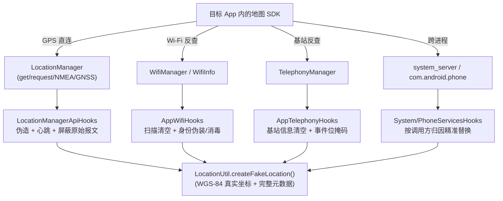

# 03 - Xposed 模块层（`xposed` 包）

模块层在 LSPosed 注入的每个 scope 进程内运行，职责：**拦截一切能暴露真实位置的系统 API 通道，并以伪造数据替代**。

## 1. 包结构

```text
xposed/
├── ModuleEntry.kt          # 入口：XposedModule 子类，按进程分派 Hook 集合
├── hooks/
│   ├── LocationApiHooks.kt          # android.location.Location 字段级 getter Hook
│   ├── LocationManagerApiHooks.kt  # LocationManager 全量 Hook + 心跳分发
│   ├── AppWifiHooks.kt             # WifiManager / WifiInfo 清洗
│   ├── AppTelephonyHooks.kt        # TelephonyManager 基站清空
│   ├── SystemServicesHooks.kt      # system_server 级 Hook（可选）
│   ├── PhoneServicesHooks.kt       # com.android.phone 进程 Hook（可选）
│   └── WifiIdentityHookPolicy.kt   # Wi-Fi 身份伪装的共享门控与数据快照
└── utils/
    ├── LocationUtil.kt     # 伪造状态单例 + createFakeLocation
    └── PreferencesUtil.kt  # 远程偏好读取器
```

## 2. 入口：`ModuleEntry`

继承现代 libxposed API 的 `XposedModule`，由 `META-INF/xposed/java_init.list` 声明（`com.noobexon.xposedfakelocation.xposed.ModuleEntry`）。

| 生命周期回调 | 做什么 |
| :--- | :--- |
| `onModuleLoaded` | 把 libxposed logger 注入 `LocationUtil` / `PreferencesUtil`（两者都有 `@Volatile var logger` 钩子） |
| `onPackageLoaded` | `initRemotePreferences()`：`getRemotePreferences("settings")` 交给 `PreferencesUtil.init()`，保证 Hook 触发前偏好可用 |
| `onPackageReady` | `isFirstPackage` 去重后分派：`com.android.phone` → `PhoneServicesHooks`；其余 → 四件套 + 可选 Toast |
| `onSystemServerStarting` | 仅当 `enable_system_hooks=true` 时安装 `SystemServicesHooks` |

Toast 实现：Hook `android.app.Instrumentation.callApplicationOnCreate`，在目标 App 的 Application 创建后用其 context 弹 "Fake Location Is Active!"（可在设置中关闭）。

## 3. 目标 App 进程四件套

### 3.1 `LocationApiHooks` — Location 字段级替换

对 `android.location.Location` 的 getter 逐个 Hook，替换返回值：

| 方法 | 触发条件 | 返回 |
| :--- | :--- | :--- |
| `getLatitude` / `getLongitude` | 始终（isPlaying 时） | `LocationUtil.latitude/longitude` |
| `getAccuracy` / `getAltitude` / `getVerticalAccuracyMeters` / `getSpeed` / `getSpeedAccuracyMetersPerSecond` | 对应 `use_xxx` 开关 | 对应伪造值 |
| `getMslAltitudeMeters` / `getMslAltitudeAccuracyMeters` | API 34+ 且开关开启 | 对应伪造值 |
| `isFromMockProvider`（及 API 31+ `isMock`） | 始终 | **false** |

每次拦截先调用 `LocationUtil.updateLocation()` 刷新状态（热更新）。

### 3.2 `LocationManagerApiHooks` — 拉取/推送全通道拦截

这是防"2 秒回跳真实位置"的核心类。拦截清单：

| API | 策略 |
| :--- | :--- |
| `getLastKnownLocation` | 返回伪造 Location（保留原 provider 元数据） |
| `getLastLocation`（API 31+） | 同上（FUSED_PROVIDER） |
| `getCurrentLocation`（API 30+） | 不等硬件，直接反射调用 `Consumer.accept(伪造位置)`（优先用入参 executor，否则主线程） |
| `requestLocationUpdates` | 提取 `LocationListener` → 动态 Hook 其实现类的 `onLocationChanged`（沿父类链递归，`hookedListenerClasses` 去重）+ 加入心跳监听池 |
| `requestSingleUpdate` | 同上 + 立即经主线程推送一次伪造位置 |
| `removeUpdates` | 从监听池移除并停心跳 |
| `addNmeaListener` / `registerGnssNmeaCallback` | **屏蔽注册**（防 `$GPGGA`/`$GPRMC` 报文解析真实坐标） |
| `registerGnssStatusCallback` / `addGpsStatusListener` | **屏蔽注册** |
| `registerGnssMeasurementsCallback` / `registerGnssNavigationMessageCallback` / `registerAntennaInfoListener` | **屏蔽注册**（防伪距原生解算） |

**心跳分发**：`startContinuousHeartbeatLoop()` 用单线程 `ScheduledExecutorService`（守护线程 `FakeLoc-Heartbeat`）每 **1000ms** 向 `registeredListeners`（`WeakHashMap` 支撑的弱引用集合）中的所有监听器经主线程推送新鲜伪造位置——防止地图 SDK 因室内无卫星信号超时降级回网络定位。

`onLocationChanged` 动态 Hook 会递归遍历 listener 的类继承链，替换参数中的 `Location` 与 `List<Location>`。

### 3.3 `AppWifiHooks` — Wi-Fi 探针阻断

国内地图 SDK 的室内定位主通道是 Wi-Fi AP 扫描（BSSID+RSSI 上云反查）。isPlaying 时：

1. `WifiManager.getScanResults()` → 恒返回**空列表**；
2. `WifiManager.startScan()` → 吞掉调用返回 true；
3. `WifiInfo.getBSSID()/getSSID()/getMacAddress()` **实体类直 Hook**（覆盖 `ConnectivityManager.getNetworkCapabilities()` 等新式获取路径）：
   - 若启用 Wi-Fi 身份伪装且该 App 在目标集合内 → 返回用户配置的 SSID/BSSID；
   - 否则返回掩码 BSSID `02:00:00:00:00:00` / `"AndroidWifi"`；
4. `WifiManager.getConnectionInfo()` → 返回 `WifiInfo.Builder()` 构造的伪造/消毒对象。

### 3.4 `AppTelephonyHooks` — 基站通道清空

isPlaying 时对 `TelephonyManager`：

- `getAllCellInfo()` → 空列表；`getCellLocation()` → null；`getNeighboringCellInfo()` → 空列表；`requestCellInfoUpdate` → 阻断；
- `listen(listener, events)` → 用掩码 `(0x10 or 0x400).inv()` **剥掉** `LISTEN_CELL_LOCATION` 与 `LISTEN_CELL_INFO` 事件位后再放行；
- `registerTelephonyCallback`（API 31+）→ 回调类名/接口含 "Cell" 时拒绝注册。

### 3.5 `WifiIdentityHookPolicy` — 共享门控

`system_server` 与 App 进程两处 Wi-Fi Hook 共用的运行时开关与数据快照（`WifiIdentity` data class：ssid/bssid/rssi/targetApps）：

- `readActiveIdentity(module)`：读远程偏好，`is_playing && enable_wifi_identity` 同时为真才返回非 null；
- `targetsSystemWifiCaller(args, targetApps)`：Wi-Fi 系统服务调用的首参即调用方包名，据此做目标归因。

## 4. 可选系统级 Hook

### 4.1 `PhoneServicesHooks`（`com.android.phone` 进程）

Hook `com.android.phone.PhoneInterfaceManager` 的 `getCellLocation` / `getAllCellInfo` / `getNeighboringCellInfo` / `requestCellInfoUpdateInternal`。调用参数中的 String 即调用方包名（`extractPackageName`），仅当其在 `target_apps` 中才清空/阻断——**按调用方精准归因，不影响非目标应用**。

### 4.2 `SystemServicesHooks`（`system_server`，需重启生效）

最深的拦截层，覆盖：

| 目标 | 手段 |
| :--- | :--- |
| `LocationManagerService`（多版本类名兼容查找） | `getLastLocation` 结果替换；`getCurrentLocation` 阻断；`requestGeofence` 拒绝注册 |
| `LocationProviderManager.onReportLocation`（API 31+） | 遍历 `mRegistrations`，按注册方包名归因：目标注册直接投递伪造 `LocationResult`（反射 `acceptLocationChange` + `executeOperation`），非目标走原路——**同一 provider 下按 App 精准分发** |
| `Receiver.callLocationChangedLocked` | `thisObject` 上归因调用方，替换 Location 参数 |
| MIUI 私有服务（小米系设备判定后） | `MiuiBlurLocationManager(Impl)` 的 `getBlurryLocation` 替换、`getBlurryCellLocation`/`getBlurryCellInfos` 清空、`handleGpsLocationChangedLocked` 阻断 |
| `GnssManagerService` / `LocationManagerService` | 阻断 `addGnssMeasurementsListener` 等 6 个 GNSS 注册入口 |
| `WifiServiceImpl`（经 `SystemServiceManager.loadClassFromLoader` 择机 Hook） | `getScanResults` 清空 / `getConnectionInfo` 替换（经 `targetsSystemWifiCaller` 归因） |

**归因机制**（`collectPackageNames`）：从调用参数对象递归（深度 ≤5，含 `visited` 防环）提取包名——遍历 `WorkSource`、反射读取 `mPackageName`/`callingPackage`/`mAttributionSource`/`mRequest` 等字段与 `getPackageName()`/`getCallingPackage()` 等方法，最后与 `target_apps` 求交集。`looksLikePackageName` 用"含点且非 android.location.*"过滤误报。

## 5. Hook 端工具

### 5.1 `LocationUtil`（伪造状态单例）

- 字段：latitude/longitude/accuracy/altitude/verticalAccuracy/meanSeaLevel(±Accuracy)/speed(±Accuracy)，全部 `private set`；
- `updateLocation()`（`@Synchronized`）：从 `PreferencesUtil` 拉取最新值；开启随机半径时经 Haversine 均匀采样圆内随机点（`getRandomLocation`）；
- `createFakeLocation(original?, provider)`（`@Synchronized`）：构造伪造 Location——当前毫秒时间戳 + `elapsedRealtimeNanos`（防加固 SDK 判过期）、可选字段仅非零才覆盖（保留原始 metadata）、accuracy 缺省 3.0m（防地图 SDK 判无效丢弃）、`HiddenApiBypass.invoke(..., "setIsFromMockProvider", false)` 清除 mock 标记。

### 5.2 `PreferencesUtil`（远程偏好读取器）

- `init(prefs)` 注册变更监听（**强引用持有 listener**，防 SharedPreferences 弱引用 GC 失效）；
- 类型化 getter 家族（isPlaying、lastClickedLocation、各 use_xxx/xxx…）；
- `getPreference<T>` 泛型分派：Double 走 long bits、Float/Boolean 原生、其余 Gson JSON 反序列化；
- `getTargetApps()`：解析 JSON 数组为 Set，失败回空集合。

## 6. 防泄漏链路总览


