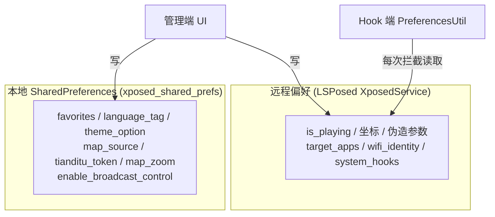
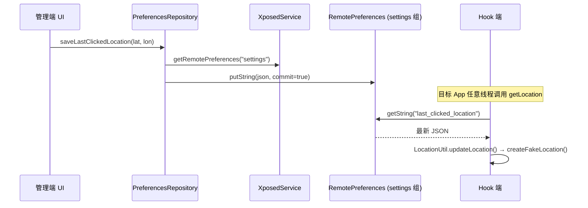

# 04 - 数据层（`data` 包）

数据层是管理端与 Hook 端的**共享契约**：常量、模型与唯一仓库。三个包（`data` / `manager` / `xposed`）都依赖它，它不依赖任何一方。

## 1. 包结构

```text
data/
├── Constants.kt                       # 全部偏好键、默认值、工具函数、物理常量
├── model/
│   ├── LastClickedLocation.kt         # 当前伪造目标点 (lat, lon)
│   └── FavoriteLocation.kt            # 收藏地点 (name, lat, lon, description)
└── repository/
    └── PrefrencesRepository.kt        # 单一数据源仓库（注意：文件名拼写沿用上游）
```

## 2. `Constants.kt` — 契约中枢

三类内容：

**标识与偏好组**

| 常量 | 值 | 用途 |
| :--- | :--- | :--- |
| `MANAGER_APP_PACKAGE_NAME` | `io.github.souitou.mockx` | 防自身被伪装的白名单检测 |
| `SHARED_PREFS_FILE` | `xposed_shared_prefs` | 管理端**本地** SharedPreferences 文件名 |
| `REMOTE_PREFS_GROUP` | `settings` | LSPosed **远程**偏好组名（两端通信的"频道"） |
| `SYSTEM_HOOK_PACKAGES` | `["system", "com.android.phone"]` | 系统级 Hook 开关联动的 scope 包名 |

**偏好键**（`KEY_*`，成对出现 `use_xxx` 开关 + `xxx` 数值）：

`is_playing`、`last_clicked_location`、`use_accuracy/accuracy`、`use_altitude/altitude`、`use_randomize/randomize_radius`、`use_vertical_accuracy/vertical_accuracy`、`use_mean_sea_level(+_accuracy)`、`use_speed(+_accuracy)`、`favorites`、`target_apps`、`hide_fake_location_toast`、`enable_broadcast_control`、`language_tag`、`enable_system_hooks`、`enable_wifi_identity`、`theme_option`、`wifi_ssid/bssid/rssi`、`map_source`、`tianditu_token`、`map_zoom`。

每个键都有 `DEFAULT_*` 默认值（几乎所有开关默认 **false**；图源默认 `amap_vector`；缩放默认 18.0）。

**工具函数与杂项**：`normalizeWifiSsid()`（SSID 截断 32 字节 + UTF-8 合法性回退）、`MAC_ADDRESS_REGEX`、Wi-Fi RSSI 范围 `[-127, 0]`、地球半径 `RADIUS_EARTH = 6378137.0`、地图缩放常量与定位探测重试参数（80 次 × 100ms）。

## 3. 双偏好存储模型



划分原则（见 `PrefrencesRepository` 类注释）：

- **Hook 共享设置** → 远程偏好。仅在 `XposedService` 绑定时可用（未绑定时读回默认值、写被丢弃——UI 本身就门控在服务绑定之后）；
- **管理端独占设置**（语言、收藏、图源等）→ 本地文件。即使模块被禁用、启动瞬间也可用。

## 4. `PreferencesRepository` — 单一数据源

所有设置**只存在一处**：每个键恰好一个属主（远程或本地）。读写对称编码：

- `Double` 类型经 `Double.doubleToRawLongBits` ↔ `Long.longBitsToDouble` 编码（SharedPreferences 无 putDouble）——与 Hook 端 `PreferencesUtil.getPreference<Double>` 完全对称；
- `LastClickedLocation` / 收藏列表 / `target_apps` 以 Gson JSON 字符串存储。

**响应式读取**：

```kotlin
remoteFlow(key, default, read) =
    App.serviceState.flatMapLatest { service ->
        // 未绑定 → flowOf(default)
        // 已绑定 → prefsChangeFlow(prefs, key) { read(prefs) }
    }
```

`prefsChangeFlow` 用 `callbackFlow` + `OnSharedPreferenceChangeListener`（注册即首发当前值）。本地同理（`localFlow`）。

**写入**：`editRemote {}`（服务未绑定则告警丢弃）/ `editLocal {}`；远程写使用 `commit = true` 保证跨进程立即可见。

**对外 API 模式**：每个设置项三件套——`getXxxFlow(): Flow<T>`（UI 收集）、`getXxx(): T`（同步读）、`suspend saveXxx(v)`（挂起写）。收藏另有 `addFavorite/removeFavorite/updateFavorite` 的读-改-写封装。

## 5. 数据模型

| 类 | 字段 | 序列化 |
| :--- | :--- | :--- |
| `LastClickedLocation` | `latitude: Double, longitude: Double` | Gson → 远程偏好 `last_clicked_location` |
| `FavoriteLocation` | `name, latitude, longitude, description` | Gson 列表 → 本地 `favorites` |

## 6. 跨进程一致性时序

管理端写入到 Hook 端可见的完整链路：



由于 Hook 端**每次拦截都重新读取**（无内存缓存决策值），该链路即"热更新"的全部秘密——无需重启目标 App、无需广播通知。
