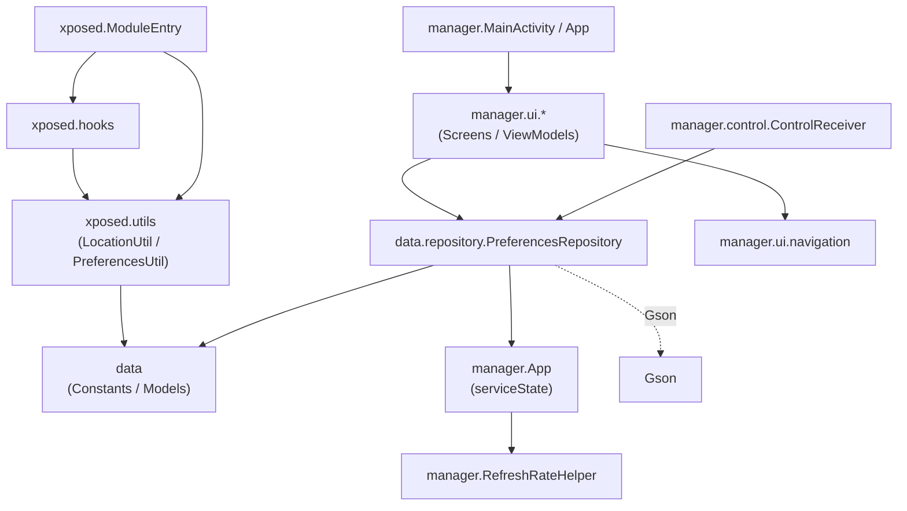

# 06 - 依赖关系

## 1. 技术栈与版本

| 组件 | 版本 | 来源（`gradle/libs.versions.toml`） |
| :--- | :--- | :--- |
| Gradle | 8.9 | wrapper 分发（腾讯镜像） |
| Android Gradle Plugin | 8.7.0 | `agp` |
| Kotlin | 2.2.10 | `kotlin`（含 compose 编译器插件 2.2.10） |
| JVM / Java 兼容 | 21 | `compileOptions` / `kotlinOptions.jvmTarget` |
| compileSdk / targetSdk | 36 | — |
| minSdk | 29 | Android 10 |

## 2. 第三方依赖清单

### UI 与应用框架

| 依赖 | 版本 | 用途 |
| :--- | :--- | :--- |
| `androidx.core:core-ktx` | 1.10.1 | 核心 KTX |
| `androidx.lifecycle:lifecycle-runtime-ktx` / `viewmodel-compose` | 2.6.1 / 2.8.6 | 生命周期与 ViewModel |
| `androidx.activity:activity-compose` | 1.8.0 | Compose Activity |
| `androidx.compose:compose-bom` | 2024.04.01 | Compose BOM（ui/material3/icons-extended 等） |
| `androidx.navigation:navigation-compose` | 2.9.8 | 屏幕导航 |
| `androidx.navigationevent:navigationevent(-compose)` | 1.1.2 | **必需**：为 Miuix 弹窗提供返回事件调度器（`LocalNavigationEventDispatcherOwner`），缺失会闪退 |
| `top.yukonga.miuix.kmp:miuix-ui/-preference/-icons` | 0.9.3 | Miuix（HyperOS 风格）组件库：Squircle、WindowDialog、弹簧开关等 |

### 地图

| 依赖 | 版本 | 用途 |
| :--- | :--- | :--- |
| `org.osmdroid:osmdroid-android` | 6.1.20 | 开源地图引擎；配 `CustomTileSources` 接高德/天地图/OSM 瓦片 |

### 图标与图片

| 依赖 | 版本 | 用途 |
| :--- | :--- | :--- |
| `compose-icons:line-awesome-android` / `font-awesome` | 1.1.1 / 1.0.0 | 图标库 |
| `io.coil-kt:coil-compose` | 2.7.0 | 图片加载 |

### Xposed 与系统能力

| 依赖 | 版本 | 用途 |
| :--- | :--- | :--- |
| `io.github.libxposed:api` | 101.0.0 | **compileOnly**——现代 Xposed API，由 LSPosed 运行时提供 |
| `io.github.libxposed:service` | 101.0.0 | implementation——管理端绑定 XposedService / RemotePreferences |
| `org.lsposed:hiddenapibypass` | 6.1 | 调隐藏 API（清除 `isFromMockProvider` 标记） |
| `com.google.code.gson:gson` | 2.14.0 | 偏好对象 JSON 序列化 |

### 测试

`junit:4.13.2`、`androidx.test.ext:junit:1.1.5`、`espresso-core:3.5.1`、Compose ui-test-junit4（androidTest）。

## 3. 包间依赖规则

- `data` 不依赖 `manager`/`xposed`（仅 `PreferencesRepository` 引用 `manager.App` 的 serviceState——数据层知道"谁持有服务"这一点是唯一反向锚点）；
- `xposed.*` 与 `manager.*` **互不依赖**，仅通过远程偏好（`data.Constants` 定义的键契约）通信；
- `xposed` 端禁止使用任何 AndroidX/Compose 类（运行在他人进程，保持最小足迹——事实如此：Hook 类只使用 framework 反射 + Gson + HiddenApiBypass）。

## 4. 构建脚本要点（`app/build.gradle.kts`）

| 配置 | 说明 |
| :--- | :--- |
| `namespace` | `com.noobexon.xposedfakelocation`（源码包名，与 applicationId 不同） |
| `applicationId` | `io.github.souitou.mockx`（MockX 品牌包名） |
| `packaging.resources.merges += "META-INF/xposed/*"` | 把模块声明合并进 APK（libxposed 识别） |
| `ndk.abiFilters` | 默认仅 `arm64-v8a`；`-PtargetAbi=all` 打全架构；`-PtargetAbi=x86,arm64-v8a` 逗号列表 |
| release | `minifyEnabled` + `shrinkResources` + 默认 proguard 规则；**签名用 debug keystore**（`signingConfig = debug`） |
| lint | `abortOnError=false`、`checkReleaseBuilds=false`（规避 AGP 8.7 + Kotlin 2.x 已知误报） |
| `resolutionStrategy` | 强制 kotlin-stdlib 2.2.10（对齐 Miuix 元数据） |
| `check*AarMetadata` 禁用 | 规避 Miuix AAR 元数据冲突 |

## 5. 模块声明（`META-INF/xposed/`）

| 文件 | 内容 |
| :--- | :--- |
| `module.prop` | `minApiVersion=101`、`targetApiVersion=101`、`staticScope=false` |
| `java_init.list` | 入口类 `com.noobexon.xposedfakelocation.xposed.ModuleEntry` |
| `scope.list` | **空**——scope 由管理端运行时动态写入 LSPosed |
