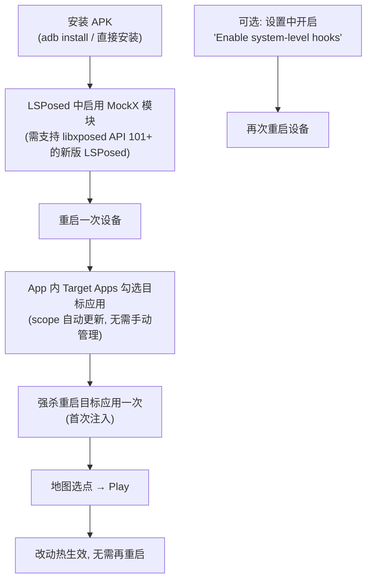

# 07 - 构建与运行

## 1. 环境要求

| 项 | 要求 |
| :--- | :--- |
| JDK | OpenJDK 21（`JAVA_HOME` 指向 21；高版本可能触发 class 元数据解析异常） |
| Android SDK | compileSdk 36；Build-Tools 34.0.0+ |
| SDK 定位 | `ANDROID_HOME` 环境变量，或项目根 `local.properties`：`sdk.dir=/path/to/sdk` |
| Android Studio | 任意支持 AGP 8.7 / Kotlin 2.2 的近期版本（可选，CLI 足矣） |

## 2. 构建命令

```shell
# 单元测试（坐标转换 + Wi-Fi 策略 + 示例）
./gradlew testDebugUnitTest

# Debug APK（完整调试符号）
./gradlew assembleDebug

# Release APK（默认 arm64-v8a，混淆 + 资源收缩，debug 签名，约 4.5 MB）
./gradlew assembleRelease

# 全架构（x86 / armeabi-v7a / arm64-v8a）
./gradlew assembleRelease -PtargetAbi=all

# 指定 ABI 列表
./gradlew assembleRelease -PtargetAbi=x86_64,arm64-v8a

# 指定版本号（CI 发布用；本地缺省 1.1beta）
./gradlew assembleRelease -PappVersionName=v1.2.3
```

产物位置：

- Debug：`app/build/outputs/apk/debug/app-debug.apk`
- Release：`app/build/outputs/apk/release/app-release.apk`

**版本号机制**（`app/build.gradle.kts`）：`resolveVersionName()` 依次取 `-PappVersionName` → 环境变量 `APP_VERSION_NAME` → 兜底 `1.1beta`（去 `v` 前缀）；`resolveVersionCode()` 把 semver 映射为单调整数（`1.2.3 → 10203`）。

## 3. CI（`.github/workflows/release.yml`）

发布 GitHub Release 时触发：checkout → JDK 21（temurin）→ 从 secret `DEBUG_KEYSTORE_BASE64` 恢复 debug keystore（保持签名稳定）→ `assembleDebug -PappVersionName=<tag>` → 重命名并 `gh release upload` 附到 Release。**需先在仓库 secrets 配置 `DEBUG_KEYSTORE_BASE64`，否则构建失败。**

## 4. 安装与激活（用户流程）



要点：

1. **LSPosed 版本是硬前提**——模块基于 libxposed API 101（`minApiVersion=101`），旧版管理器不会加载。从官方 Telegram 频道 [t.me/LSPosed](https://t.me/LSPosed) 获取最新版；
2. Scope 完全由 MockX 应用内管理（`scope.list` 为空 + 运行时写入），**不要**再在 LSPosed 里手动编辑模块 scope；
3. 系统级 Hook（`system` + `com.android.phone`）开启/关闭后各需重启一次；
4. 最低 Android 版本：**10（API 29）**。

## 5. 外部控制（Headless）

设置 → External Control 打开后，可从任意 App 或 `adb shell` 广播控制（默认关闭，组件 `enabled=false`）：

```shell
adb shell am broadcast \
  -a io.github.souitou.mockx.action.START \
  -n io.github.souitou.mockx/.manager.control.ControlReceiver \
  --ed latitude 37.7749 --ed longitude -122.4194
```

三个 Action：`io.github.souitou.mockx.action.START` / `.STOP` / `.SET_LOCATION`（extras：`latitude`/`longitude`/`accuracy`/`start`）。安全模型：导出且无权限校验（有意为之），输入做范围硬校验。详见 `docs/EXTERNAL_CONTROL.md`（其中旧包名示例请以上述新 Action 为准）。

## 6. 日志调试

Hook 端所有日志经 libxposed 通道（`ModuleEntry.initLoggers()` 注入）：

- LSPosed 管理器 → 模块日志页查看，Tag 前缀：`[ModuleEntry]`、`[LocationUtil]`、`[PreferencesUtil]`、`[LocationApiHooks]`、`[LocationManagerApiHooks]`、`[AppWifiHooks]`、`[AppTelephonyHooks]`、`[SystemServicesHooks]`、`[PhoneServicesHooks]`；
- `PreferencesUtil` 会打印每次远程偏好变更（`Remote pref changed: <key>`），可据此确认热更新链路是否通畅。

## 7. 常见验证清单

| 现象 | 检查 |
| :--- | :--- |
| 模块不加载 | LSPosed 版本是否支持 API 101；模块是否启用；目标应用是否进了 scope |
| 目标应用定位不变 | 是否强杀重启过一次；日志中 `getLastKnownLocation -> spoofed` 是否出现 |
| 高德/百度数秒后跳回真实位置 | 心跳日志（`FakeLoc-Heartbeat`）；Wi-Fi/基站 Hook 是否生效（`Cleared Wi-Fi scan results`） |
| 高德地图上偏差 300~500m | 图源与坐标系（GCJ-02 底图取点是否走了反算；检查 `CoordinateTransformTest`） |
| 设置改动不生效 | `Remote pref changed` 日志是否出现；XposedService 是否绑定（`App.service`） |
